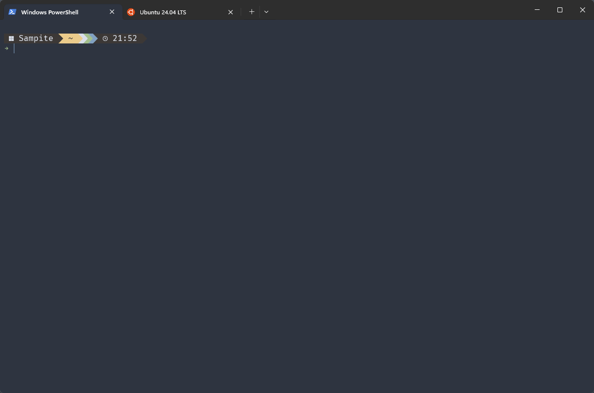
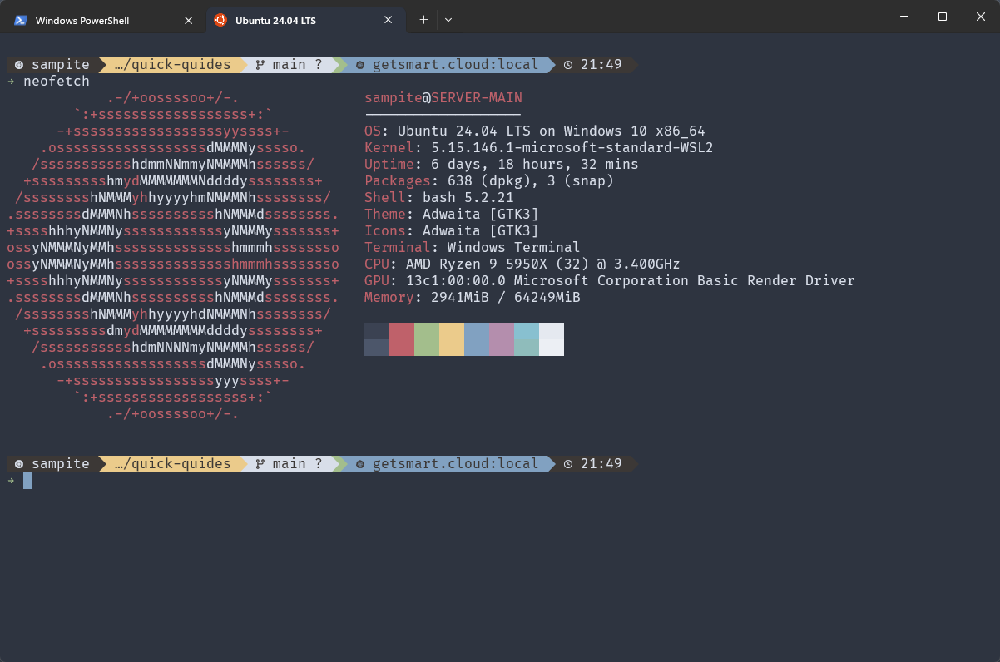

# Terminal Setup

### Preview of multiple terminals open in WindowsTerminal
| Windows, with minimal info | Linux, with extra info |
|:---:|:---:|
|  |  |

### Overview
 todo

###  01 - Install Font

- Go to [https://github.com/tonsky/FiraCode/wiki](https://github.com/tonsky/FiraCode/wiki) and follow the install guides.
- Install the font on both Windows and Linux, and enable it in your editor also to have the best exp.
  
### 02 - Install Starship

- Got to [https://starship.rs/guide/](https://starship.rs/guide/) and install it on both Windows and Ubuntu  
- **Windows:**  
  Use `winget install --id Starship.Starship`  
- **Ubuntu:**  
  Use `curl -sS https://starship.rs/install.sh | sh`  
  or check the file first if you want:  
  ```
  curl -fsSL -o get_starship.sh https://starship.rs/install.sh
  chmod 700 get_starship.sh
  ./get_starship.sh
  ```

### 03 - Add your custom config

- **Windows:**  
  Create a config file at `C:\Users\<USRNAME>\.config\starship.toml` and copy the contents of `starship.toml` from this guides folder.  
- **Ubuntu:**  
  Create a config file `touch ~/.config/starship.toml` and copy the contents of `starship.toml` from this guides folder.  
- **Expand:**  
  You can use this as is, or as a base and add your own extras.  
  How to: [https://starship.rs/config/](https://starship.rs/config/)


### 04 - Load Starship for your shells

- **Windows:**  
  Run `echo $PROFILE` to get the path of you current profile.  
  *My default: `C:\Users\<USRNAME>\Documents\WindowsPowerShell\Microsoft.PowerShell_profile.ps1`*  
  Open it with your favourite editor and add the following line, when you want it to load:  
  `Invoke-Expression (&starship init powershell)`
- **Ubuntu:**  
  Add the following line to your `.bashrc` when you want it to load:  
  `eval "$(starship init bash)"`
- **Expand:**  
  You can find advanced configs here: [https://starship.rs/advanced-config/](https://starship.rs/advanced-config/)

### 05 - Add WindowsTerminal Nord theme

- Open your WindowsTerminal `settings.json`
- Add the following to the `"schemes"` array 
  ```JSON
  {
    "background": "#2E3440",
    "black": "#3B4252",
    "blue": "#81A1C1",
    "brightBlack": "#4C566A",
    "brightBlue": "#81A1C1",
    "brightCyan": "#8FBCBB",
    "brightGreen": "#A3BE8C",
    "brightPurple": "#B48EAD",
    "brightRed": "#BF616A",
    "brightWhite": "#ECEFF4",
    "brightYellow": "#EBCB8B",
    "cursorColor": "#81A1C1",
    "cyan": "#88C0D0",
    "foreground": "#D8DEE9",
    "green": "#A3BE8C",
    "name": "Nord",
    "purple": "#B48EAD",
    "red": "#BF616A",
    "selectionBackground": "#434C5E",
    "white": "#E5E9F0",
    "yellow": "#EBCB8B"
  },
  ```
- And finally update your profile defaults:
  ```JSON
  "profiles": 
  {
    "defaults": 
    {
        "colorScheme": "Nord",
            "font": 
            {
                "face": "FiraCode Nerd Font Mono",
                "size": 12.0
            }
    //...
    }
  //...
  }       
  ```

### 05 - Match it with a VSCode Nord theme

- Get it at [https://marketplace.visualstudio.com/items?itemName=arcticicestudio.nord-visual-studio-code](https://marketplace.visualstudio.com/items?itemName=arcticicestudio.nord-visual-studio-code)
